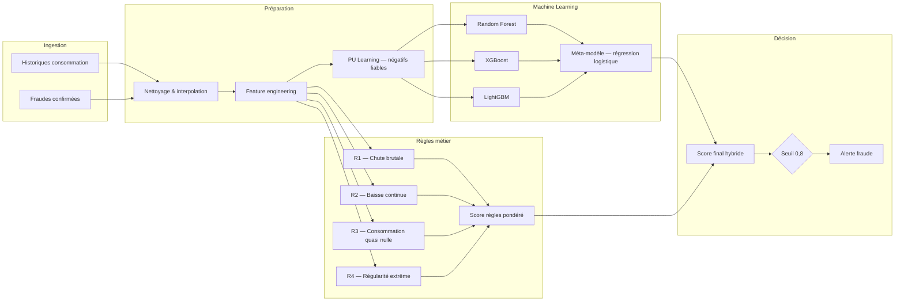

# Détection prédictive des fraudes hydriques et énergétiques

**Stage d’initiation — Amendis (Veolia Maroc) · ENSA Tétouan · 2024–2025**

Système hybride de détection de fraudes sur les historiques de consommation, combinant **machine learning** (PU Learning, stacking) et **règles métier** calibrées avec les équipes terrain.

---

## Sommaire

- [Contexte](#contexte)
- [Problématique](#problématique)
- [Objectifs](#objectifs)
- [Approche](#approche)
- [Architecture du système](#architecture-du-système)
- [Données et feature engineering](#données-et-feature-engineering)
- [Modélisation](#modélisation)
- [Règles métier](#règles-métier)
- [Fusion hybride et décision](#fusion-hybride-et-décision)
- [Résultats](#résultats)
- [Livrables du dépôt](#livrables-du-dépôt)
- [Perspectives](#perspectives)
- [Auteur et encadrement](#auteur-et-encadrement)

---

## Contexte

La fraude sur la consommation d’**eau** et d’**électricité** génère des pertes économiques importantes et complique la gestion des réseaux. Chez **Amendis**, filiale marocaine du groupe **Veolia**, l’enjeu touche directement la performance opérationnelle et la qualité de service.

Ce projet s’inscrit dans une démarche d’**analytique avancée** : exploiter les historiques de comptage pour repérer les comportements atypiques, tout en s’appuyant sur l’expertise métier pour limiter les fausses alertes coûteuses.

---

## Problématique

Les fraudes prennent des formes variées (manipulation de compteur, branchements illégaux, anomalies de facturation, compteurs bloqués, etc.). Une détection uniquement manuelle ou purement statistique ne suffit pas face à la diversité des schémas.

Le système visé doit :

- produire des **scores fiables** par client/contrat ;
- privilégier la **précision** (réduire les interventions inutiles) tout en conservant un **rappel** acceptable ;
- rester **explicable** et **déployable** dans un contexte opérationnel.

---

## Objectifs

| Axe | Description |
|-----|-------------|
| Données | Analyser et préparer les historiques de consommation et les cas de fraude confirmés |
| ML | Identifier les comportements suspects via modèles supervisés robustes |
| Métier | Formaliser et intégrer des règles terrain (chutes, baisses structurelles, consommation nulle, régularité extrême) |
| Hybride | Fusionner scores ML et scores règles pour une détection plus stable |
| Exploitation | Pipeline avec évaluation, visualisations et recalibration périodique |

---

## Approche

La solution repose sur un **pipeline complet** :

1. **Prétraitement** (valeurs manquantes, normalisation)
2. **Feature engineering** (statistiques, tendances, forme de série, features dérivées des règles)
3. **PU Learning** pour construire un jeu d’entraînement avec positifs confirmés et négatifs fiables
4. **Stacking** (Random Forest, XGBoost, LightGBM ? méta-modèle logistique)
5. **Gestion du déséquilibre** (pondération des classes, SMOTE / ADASYN sur le train uniquement)
6. **Fusion hybride** avec les règles métier pondérées et seuil décisionnel optimisé

---

## Architecture du système

---

## Données et feature engineering

### Sources

- **Consommations mensuelles** : identifiants client/contrat, **30 mois** (janvier 2023 ? juin 2025)
- **Registre des fraudes** déjà détectées par Amendis (fusion avec les historiques)

### Prétraitement

- Interpolation linéaire si **? 5 mois** manquants ; exclusion au-delà
- Normalisation des variables pour stabiliser l’apprentissage

### Familles de variables (extrait)

| Famille | Exemples |
|---------|----------|
| Niveau & dispersion | Moyenne 30 mois, écart-type, CV, min/max |
| Tendances & dynamique | Pente 30 mois, deltas récents, `MaxDrop`, `DropCount`, `SpikeCount` |
| Forme de série | Skewness, kurtosis, amplitude saisonnière |
| Règles encodées | `R1_*`, `R3_*`, `R4_*` (fréquence, intensité, extrêmes) |

---

## Modélisation

### Labels incertains — PU Learning

Les clients « non fraudeurs » peuvent inclure des fraudes non encore détectées. Un **Random Forest** est entraîné sur positifs confirmés + un échantillon non labellisé ; les clients à **plus faible probabilité** servent de **négatifs fiables** pour l’entraînement final.

### Split temporel

| Jeu | Part |
|-----|------|
| Train | 70 % — mois les plus anciens |
| Validation | 15 % |
| Test | 15 % — mois les plus récents |

Ce decoupage limite la **fuite temporelle** et reproduit un usage en production.

### Stacking

| Composant | Rôle |
|-----------|------|
| **Random Forest** | 200 arbres, `class_weight='balanced'` |
| **XGBoost** | `learning_rate=0.05`, `max_depth=6`, `scale_pos_weight` |
| **LightGBM** | `num_leaves=31`, `learning_rate=0.05`, `scale_pos_weight` |
| **Méta-modèle** | Régression logistique (L2, `liblinear`) sur les prédictions des modèles de base |

Validation par **cross-validation temporelle**, **early stopping** (XGBoost / LightGBM) et suivi du **gap train/validation**.

---

## Règles métier

| Règle | Intention | Déclenchement (résumé) |
|-------|-----------|-------------------------|
| **R1 — Chute brutale** | Baisse soudaine suspecte | Baisse **? 30 %** (comparaison interannuelle sur mois fixe **ou** fenêtre glissante 3 vs 3 mois) |
| **R2 — Baisse continue** | Dégradation persistante | Baisse **? 30 %** entre années (2023 vs 2024, ou 2025 vs mêmes mois 2024) |
| **R3 — Absence de consommation** | Compteur bloqué / détournement | Moyenne 2025 **< 5 kWh** |
| **R4 — Régularité extrême** | Compteur possiblement bloqué | CV **< 2 %**, faible écart-type, faible saisonnalité, répétition sur **? 6 mois** |

Les coefficients des règles sont **optimisés (Grid Search)** pour limiter les faux positifs.

---

## Fusion hybride et décision

**Score règles** (pondération \(\gamma_i\) par règle) :

\[
\text{Score}_{\text{règles}} = \sum_i \gamma_i \cdot R_i
\]

**Score final** (calibration de \(\alpha\) par régression logistique) :

\[
\text{Score}_{\text{final}} = \alpha \cdot \text{Score}_{\text{ML}} + (1 - \alpha) \cdot \text{Score}_{\text{règles}}
\]

**Politique de décision** (optimisée par Grid Search) :

\[
\text{Score}_{\text{final}} > 0{,}8 \Rightarrow \text{client suspect}
\]

---

## Résultats

Évaluation sur le jeu de test (environ **27 000 clients** dans le périmètre du stage) :

| Métrique | Valeur | Lecture |
|----------|--------|---------|
| **AUC ROC** | **0,942** | Très bonne séparation fraudeurs / non-fraudeurs |
| **Précision** | 30,4 % | Part de vrais positifs parmi les alertes (faux positifs encore élevés) |
| **Rappel** | 70,3 % | Bonne couverture des fraudes connues |
| **F1-Score** | 42,4 % | Compromis précision/rappel, marge de progression |

Le système combine **forte capacité discriminante** (AUC) et **bon rappel**, avec une **précision opérationnelle** à améliorer — axe prioritaire des travaux futurs.

Analyses complémentaires réalisées dans le rapport : matrice de confusion, courbes ROC/PR, importance des variables et **SHAP**.

---

## Livrables du dépôt

Ce dépôt documente le projet de stage (données et code source non publiés pour des raisons de confidentialité entreprise).

| Fichier | Description |
|---------|-------------|
| [`docs/Rapport.pdf`](docs/Rapport.pdf) | Rapport technique complet (méthodologie, règles, résultats, perspectives) |
| [`docs/Présentation.pdf`](docs/Pr%C3%A9sentation.pdf) | Support de présentation du projet |

---

## Perspectives

- Application mobile pour la **validation terrain** des alertes
- Montée en charge (**> 1 M clients**) : Spark, Kafka, Airflow, pipeline ETL mensuel automatisé
- Réduction des faux positifs : PU Learning affiné, nouvelles architectures de stacking, règles métier enrichies
- Suivi longitudinal des anomalies et **rapports analytiques** pour les responsables métier

---

## Auteur et encadrement

| | |
|---|---|
| **Stagiaire** | Yassir Adila — ENSA Tétouan |
| **Encadrant entreprise** | Mourad El Mahoutti — Amendis / Veolia Maroc |
| **Durée** | 2 mois |
| **Année universitaire** | 2024–2025 |

---

## Licence et confidentialité

Les documents et méthodes décrits relèvent d’un **projet de stage en environnement professionnel**. Les jeux de données Amendis ne sont pas inclus dans ce dépôt. Toute réutilisation du contenu doit respecter les accords de confidentialité de l’entreprise d’accueil.

---

  Dépôt GitHub : <a href="https://github.com/yassiradila/Fraud_Detection_Analytics_Project">yassiradila/Fraud_Detection_Analytics_Project</a>

